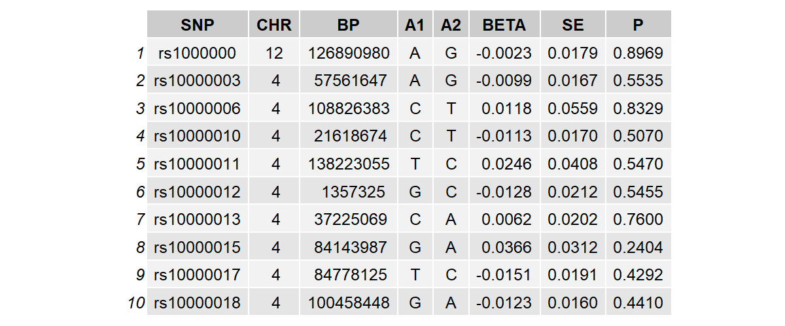

# Part 3: Data preparation

## Case Study: Testosterone on Bipolar Disorder

In this section, we demonstrate the practical application of MERLIN
using a real-world dataset. We will investigate the causal relationship
between Testosterone (Exposure) and Bipolar Disorder (BD) (Outcome),
specifically examining whether this causal effect is modified by Sex
(Environmental factor E).

## Data preparation

To successfully perform causal inference with environmental interactions
using MERLIN, you need to prepare specific datasets. The core inputs
consist of four sets of summary statistics and a reference panel for LD
estimation.

### Summary Statistics Format

MERLIN requires four summary statistics files:

Exposure GWAS (expgwas): Main genetic effects on the exposure.

Exposure GWIS (expgwis): Genetic-environmental interaction effects on
the exposure.

Outcome GWAS (outgwas): Main genetic effects on the outcome.

Outcome GWIS (outgwis): Genetic-environmental interaction effects on the
outcome.

MERLIN can still be applied when GWIS data are unavailable for either
the exposure or the outcome (see the Data Analysis section for further
details). All summary statistics files must be tab-delimited text files
(they can be gzipped, e.g., .txt.gz). They must contain the following
standard columns, with exact column names in the header:

### Constructing GWIS Data from Stratified GWAS

In many real-world scenarios, direct GWIS summary statistics might not
be publicly available. However, if the environmental factor is a binary
variable (e.g., Sex: Male/Female), you can derive both GWAS and GWIS
inputs from stratified summary statistics. Assuming sex is coded as Male
= 1 and Female = -1, and that the allele directions are perfectly
aligned between the two datasets:

GWAS (Main Effect): Can be generated by meta-analyzing the male and
female data using inverse-variance weighting (e.g., using software like
`METAL`, see <https://github.com/statgen/METAL>). After installing the
software, the analysis can be executed via the command line (e.g., in
Linux or other shell environments) using a configuration file. A sample
configuration file ‘metal.config.Testosterone.txt’ is available for
download:
<https://figshare.com/articles/dataset/Data_for_MERLIN/29910116>.

GWIS (Interaction Effect): The SNP interaction effects and their
standard errors can be derived using the following formulas:
\hat{b}\_{gwis,j}=\frac{1}{2}(\hat{b}\_{male,j}-\hat{b}\_{female,j})
se(\hat{b}\_{gwis,j})=\frac{1}{2}\sqrt{(se(\hat{b}\_{male,j})^2+se(\hat{b}\_{female,j})^2}

### Reference Panel Data

To account for Linkage Disequilibrium (LD) structure during instrumental
variable selection (LD clumping) and to estimate sample overlap, MERLIN
requires a reference panel. The reference panel must be in PLINK binary
format (.bed, .bim, .fam). For European ancestry studies, the 1000
Genomes Project European panel is highly recommended.

You will also need a genomic partition file (e.g., `all.bed`) to divide
the genome into structured LD blocks separated by recombination
hotspots. This block-wise partitioning facilitates efficient and
parallelized regional LD matrix estimation.

### Data Availability

The summary statistics required for this analysis, along with a
pre-formatted reference panel and LD block file for European
populations, can be downloaded from Figshare:
<https://figshare.com/articles/dataset/Data_for_MERLIN/29910116>.
