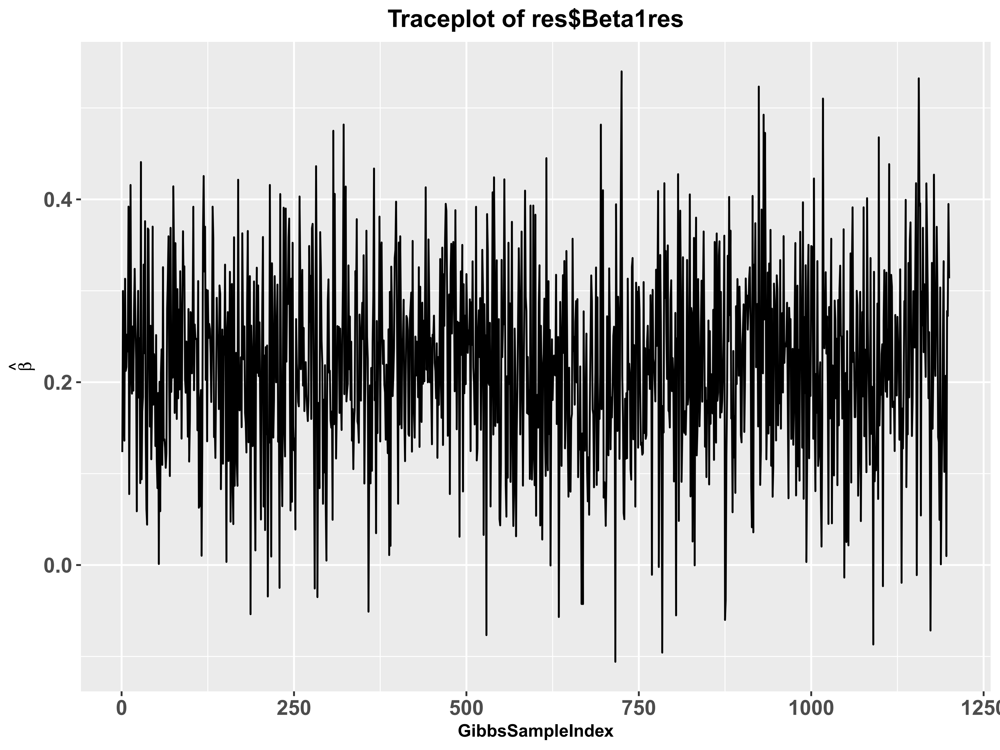
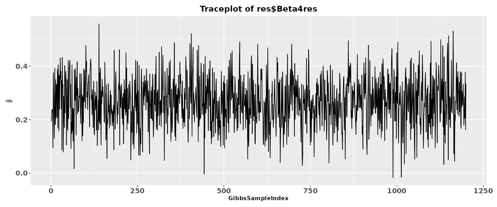

---
title: "Part 5: Real Data Analysis and Convergence Diagnostics"
date: "\\small \\today"
output:
  html_document:
    toc: yes
    toc_depth: '3'
    df_print: paged
editor_options:
  markdown:
    wrap: 72
vignette: >
  %\VignetteIndexEntry{Part 5: Real Data Analysis and Convergence Diagnostics}
  %\VignetteEngine{knitr::rmarkdown}
  %\VignetteEncoding{UTF-8}
---

```{r setup, include=FALSE}
knitr::opts_chunk$set(echo = TRUE)
options(encoding = "UTF-8")
```

## Case Study: Testosterone on Bipolar Disorder
In this final section, we demonstrate the practical application of MERLIN using a real-world dataset. We will investigate the causal relationship between Testosterone (Exposure) and Bipolar Disorder (BD) (Outcome), specifically examining whether this causal effect is modified by Sex (Environmental factor $E$).

**Data Availability**

The summary statistics required for this analysis, along with the 1000 Genomes European reference panel, can be downloaded from Figshare:https://figshare.com/articles/dataset/Data_for_MERLIN/29910116. We assume that you have already downloaded these datasets and completed the data preprocessing steps outlined in Part 2 (including `matchpanel`, `ivselect`, and `EstRhofun`).

## Loading Preprocessed Inputs
From the preprocessing pipeline in Part 2, we have already obtained the following variables:

The selected genetic instruments and their effect sizes/standard errors for both main and interaction effects 
(`gammah1`, `gammah3`, `Gammah1`, `Gammah3`, `se1`, `se2`, `se3`, `se4`).

The regularized Linkage Disequilibrium (LD) correlation matrix `R`.

The sample overlap correlation estimates `rho1` and `rho2`.

```{r}
library(MERLIN)

# For the purpose of this vignette, we assume these variables 
# (gammah1, gammah3, Gammah1, Gammah3, se1, se2, se3, se4, R, rho1, rho2) 
# are loaded in your global environment from the previous steps.
```

## Fitting the MERLIN Model
MERLIN employs a Bayesian framework (Gibbs sampling) to estimate the posterior distributions of the causal effects. The primary `MERLIN` function is highly flexible, offering various model specifications to accommodate different biological assumptions and environmental variable types.

**Choosing the Right Model Type**

The `model` argument specifies the underlying biological and statistical assumptions for the causal pathway. MERLIN currently supports five distinct modes:

- "`standard`" (Default): The comprehensive model assuming both main genetic effects and G×E interaction effects are present in both the exposure and the outcome pathways.

- "`continuous_E`": A specialized version of the standard model optimized for a continuous environmental variable.

- "`binary`": A specialized version of the standard model for binary environmental variables (e.g., Sex). This requires the additional parameter `p1`, which represents the proportion/probability of the environmental factor taking the value 1 (i.e., $P(E=1)$).

- "`MO`": Designed for practical scenarios where outcome GWIS summary statistics are unavailable. This model drops the requirement for `Gammah3`, `se4`, and `rho_2`. 

- "`ME`": Designed for practical scenarios where exposure GWIS summary statistics are unavailable. This model drops the requirement for `gammah3`, `se2`, and `rho_2`.

**MCMC Control Parameters**

To ensure the reliability of the Bayesian estimation, MERLIN provides full control over the Markov Chain Monte Carlo (MCMC) sampling process:

`maxIter`: Total number of Gibbs sampling iterations (default: `12000`).

`burnin`: Number of initial iterations discarded to allow the chain to reach its stationary distribution (default: `5000`).

`thin`: The thinning interval used to reduce autocorrelation among posterior samples (default: `10`).

`seed`: Random seed for fully reproducible MCMC results.

**Executing the Analysis**

For our Testosterone-BD case study, the environmental factor (Sex) is technically a **binary** variable. While MERLIN provides a specialized `"binary"` model, statistical evaluations have demonstrated that when the sample size ratio between the two environmental categories is relatively balanced (i.e., the proportion is close to 1:1), the default `"standard"` model is highly robust and yields almost identical causal estimates.

Therefore, for simplicity and to showcase the most universally applicable workflow, we will proceed with the default `model = "standard"`. We also specify the MCMC parameters and set a random seed to ensure strict reproducibility.


```{r,eval = FALSE}
res <- MERLIN(gammah1    = gammah1, 
              gammah3    = gammah3, 
              Gammah1    = Gammah1, 
              Gammah3    = Gammah3,
              se1        = se1, 
              se2        = se2, 
              se3        = se3, 
              se4        = se4, 
              R          = R, 
              rho_1      = rho1, 
              rho_2      = rho2,
              model      = "standard",
              maxIter    = 12000,       
              burnin     = 5000, 
              thin       = 10,
              seed       = 2026)        

str(res)
```

The console below shows the progress and output structure of MERLIN. 

```text
Running MERLIN method (Model: standard)...

--------------------------------------------------
MERLIN Analysis Completed Successfully!
Total processing time: 92.6 seconds
--------------------------------------------------

> str(res)
List of 14
 $ Beta1.hat : num 0.218
 $ Beta1.se  : num 0.103
 $ Beta1.pval: num 0.0342
 $ Beta4.hat : num 0.263
 $ Beta4.se  : num 0.0926
 $ Beta4.pval: num 0.00445
 $ gamma1    : num [1:342, 1] -0.015375 -0.000416 0.010435 -0.004966 -0.001452 ...
 $ beta2     : num [1:342, 1] -0.00985 0.01249 -0.00905 -0.01255 -0.01173 ...
 $ gamma3    : num [1:342, 1] -0.00931 -0.0068 0.01285 -0.00937 -0.00731 ...
 $ Beta1res  : num [1:1200, 1] 0.124 0.3 0.173 0.136 0.313 ...
 $ Beta4res  : num [1:1200, 1] 0.176 0.328 0.422 0.425 0.179 ...
 $ Sg12Res   : num [1:1200, 1] 0.000164 0.000167 0.000159 0.00021 0.000154 ...
 $ Sg22Res   : num [1:1200, 1] 0.00022 0.000169 0.000141 0.000162 0.000169 ...
 $ Sg32Res   : num [1:1200, 1] 6.23e-05 6.20e-05 5.59e-05 7.06e-05 5.72e-05 ...
```

MERLIN can still be applied when either the exposure GWIS or the outcome GWIS summary statistics are unavailable. As an illustrative example, we consider the case where the exposure GWIS data are missing. In this setting, users should specify `model = "ME"`, and `gammah3`, `se2`, and `rho_2` can be omitted.

```{r,eval = FALSE}
res.drop <- MERLIN(gammah1    = gammah1, 
                   gammah3    = NULL, 
                   Gammah1    = Gammah1, 
                   Gammah3    = Gammah3,
                   se1        = se1, 
                   se2        = NULL, 
                   se3        = se3, 
                   se4        = se4, 
                   R          = R, 
                   rho_1      = rho1, 
                   rho_2      = NULL,
                   model      = "ME",
                   maxIter    = 12000,       
                   burnin     = 5000, 
                   thin       = 10,
                   seed       = 2026)    
str(res.drop)
```

The console below shows the progress and output structure in this setting.

```text
Running MERLIN method (Model: ME)...

--------------------------------------------------
MERLIN Analysis Completed Successfully!
Total processing time: 0.0001 seconds
--------------------------------------------------

> str(res)
List of 6
 $ Beta1.hat : num 0.186
 $ Beta1.se  : num 0.259
 $ Beta1.pval: num 0.475
 $ Beta4.hat : num 0.725
 $ Beta4.se  : num 0.223
 $ Beta4.pval: num 0.00132
```

## Convergence Diagnostics

Because MERLIN relies on Markov Chain Monte Carlo (MCMC) methods via a Gibbs sampler, it is imperative to verify that the Markov chains have properly converged to their stationary distributions. Poor convergence indicates that the effect estimates may not be reliable. 

We can visually inspect the mixing and convergence of the sampling chains for both the main causal effect ($\beta_1$) and the interaction causal effect ($\beta_4$) using the `traceplot` function.

```{r,eval = FALSE}
# Plot MCMC trace for the main causal effect
traceplot(res$Beta1res)
```

```{r, echo=FALSE, out.width="80%"}

```

```{r,eval = FALSE}
# Plot MCMC trace for the heterogeneity (interaction) causal effect
traceplot(res$Beta4res)
```

```{r, echo=FALSE, out.width="80%"}

```

**Interpretation Guidelines for Traceplots**:

Good Convergence: The plot should look like a "hairy caterpillar," with the chain rapidly mixing and oscillating around a stable mean value without any obvious long-term trends or drifting.

Poor Convergence: If the chain exhibits slow wandering, gets stuck in certain regions, or shows a distinct upward/downward trend, you may need to increase the number of MCMC iterations or check your input data for extreme outliers.

**Note**: When using the "`MO`" or "`ME`" model, parameter estimation is no longer performed via the MCMC procedure. Consequently, convergence diagnostics are not required.

## Results Extraction and Interpretation
Once convergence is confirmed, we can extract the final point estimates (posterior means), standard errors, and P-values for our causal parameters.

```{r, eval=FALSE}
# Extract estimates for the main causal effect
MERLINbeta1   <- res$Beta1.hat
MERLINse1     <- res$Beta1.se
MERLINpvalue1 <- res$Beta1.pval

# Extract estimates for the GxE heterogeneity causal effect
MERLINbeta4   <- res$Beta4.hat
MERLINse4     <- res$Beta4.se
MERLINpvalue4 <- res$Beta4.pval
```

```{r, include=FALSE}
MERLINbeta1 <- 0.218
MERLINse1 <- 0.103
MERLINpvalue1 <- 0.0342
MERLINbeta4 <- 0.263
MERLINse4 <- 0.0926
MERLINpvalue4 <- 0.00445
```

We can format the output to draw our final epidemiological conclusions:

```{r, eval=FALSE}
cat("========================================================\n");
cat("MERLIN Causal Inference Results: Testosterone on BD\n");
cat("========================================================\n\n");

cat(sprintf("1. Average Causal Effect (Main Effect):\n"));
cat(sprintf("   Beta: %.4f\n", MERLINbeta1));
cat(sprintf("   SE:   %.4f\n", MERLINse1));
cat(sprintf("   P-val: %.2e\n\n", MERLINpvalue1));

cat(sprintf("2. Heterogeneity Causal Effect (Sex Interaction):\n"))
cat(sprintf("   Beta: %.4f\n", MERLINbeta4))
cat(sprintf("   SE:   %.4f\n", MERLINse4))
cat(sprintf("   P-val: %.2e\n", MERLINpvalue4))
```
```text
========================================================
MERLIN Causal Inference Results: Testosterone on BD
========================================================

1. Average Causal Effect (Main Effect):
   Beta: 0.2180
   SE:   0.1030
   P-val: 3.42e-02

2. Heterogeneity Causal Effect (Sex Interaction):
   Beta: 0.2630
   SE:   0.0926
   P-val: 4.45e-03
```

**Conclusion**

By evaluating these parameters, you can determine: Whether Testosterone has a significant overall causal effect on Bipolar Disorder across the entire population (based on `MERLINpvalue1`). Whether the causal effect of Testosterone on Bipolar Disorder differs significantly between males and females (based on `MERLINpvalue4`). A significant $\beta_4$ implies a strong environment-dependent (sex-specific) causal pathway.


